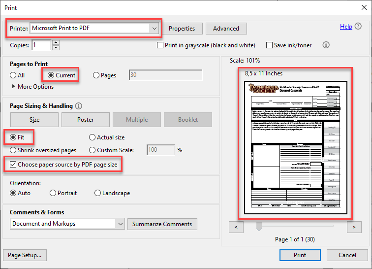

# Getting Blank Chronicle Sheets

To fill out chronicle sheets using `pfscf`, you need to have a blank/empty chronicle as PDF file with only a single page.

Blank chronicle sheets are normally included at the end of each Pathfinder/Starfinder society scenario. An exception to this are chronicles for adventure paths ([example](https://paizo.com/store/pathfinder/adventures/adventurePath/ageOfAshes)) and specials ([example](https://paizo.com/products/btq023hy/discuss?Pathfinder-Adventure-Little-Trouble-in-Big-Absalom)). In such cases download links for the associated chronicles are normally directly included on the associated product page on Paizos homepage.

The easiest way to get an empty chronicle sheet out of a scenario to use with `pfscf` is to open the scenario in a PDF viewer and then print the chronicle page to a file using a so-called PDF printer. This would create a new PDF file as output.

The problem is that, depending on the concrete printer settings/options, the documents may slightly differ. The content may look ok, but there might be small margins at the borders of the page or the like. Now as `pfscf` needs accurate positions, even such small differences may result in a chronicle that looks slightly off when filled.

Therefore, please find below some guidance on how to extract chronicle sheets in a way that worked for me.

## Windows

### Acrobat Reader

1. Open scenario PDF using the Acrobat Reader
2. Switch to last page that contains the chronicle
3. Open print dialog
4. Select printer "Microsoft Print to PDF"
5. Select "Print pages: Current"
6. Select "Fit"
7. Print

## MacOS

### Preview

1. Open adventure PDF using Preview.app
2. Make a duplicate using "File" > "Duplicate"
3. Enter an appropriate name for the new file
4. Open the thumbnail view in the sidebar, either using the sidebar button in the toolbar, or via "View" > "Thumbnails"
5. You can now simply delete pages one at a time by selecting their thumbnails and hitting delete. For most adventures, however, it will be faster to:
    a. Click in the thumbnail area
    b. Hit ⌘+A to select all
    c. Scroll to the last page
    d. ⌘+Click the last page to deselect it
    e. Hit delete to delete everything else
6. Then simply save the new PDF

## Linux

To be done, thankful for tipps.

